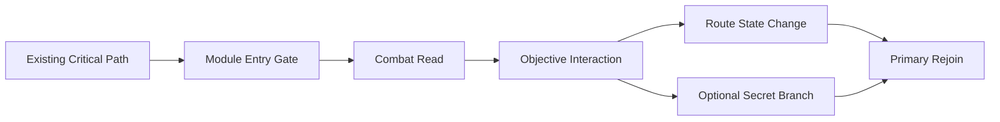

# V0.1.50 Level Expansion Routes Implementation Packet

## Non-Negotiable Scope

This is a documentation-only route expansion packet. It does not authorize edits to `Assets`, `Packages/manifest.json`, scenes, build scripts, or existing docs. Later implementation work must occur in a reviewable main-lane branch.

## Shared Build Rules

| Rule Area | Requirement |
| --- | --- |
| Units | All dimensions are Unity meters. |
| Origin | Level-local coordinates. If a scene has an existing route root, use this packet's root object as a child and keep listed coordinates local to that root. |
| Snap | Structure on `0.5m` grid; doors and route pivots on `1m` grid. |
| Player clear height | Minimum `2.8m`; target `3.2m`; large arena minimum `5.0m`. |
| Corridor clear width | Minimum `3.0m`; target combat width `4.0m`; secret width `2.0m` only if no combat occurs. |
| Stair/ramp slope | Ramps max `18deg`; stairs max `0.3m` riser, `0.5m` tread. |
| Cover | Chest cover height `1.1m`; waist cover `0.75m`; avoid cover closer than `1.2m` to door thresholds. |
| Door module | Standard clear opening `3.0m W x 3.0m H`; boss/major door `4.0m W x 4.0m H`. |
| Enemy spawn distance | Spawns at least `8m` from player unless behind locked reveal or occlusion. |
| Pickup readability | Pickups must be visible from at least one route decision point; secrets can require alternate angle. |

## Collision Proxy Ownership

Only main-lane gameplay objects own collision and triggers.

| Prefix | Owner | May Have Collider | May Have Trigger | May Have Script | Notes |
| --- | --- | --- | --- | --- | --- |
| `GEO_` | Main lane | Yes | No | No | Static floors, walls, ceilings, stairs, simple blockout. |
| `COL_` | Main lane | Yes | Optional | No | Explicit collision proxy where render mesh is decorative or complex. |
| `TRG_` | Main lane | Trigger only | Yes | Yes | Objective, encounter, hazard, secret, checkpoint, door zones. |
| `AUTH_` | Main lane | Optional | Optional | Yes | Gameplay authority object for objectives, locks, lifts, valves, hazards. |
| `SPAWN_` | Main lane | No | No | Yes/marker | Enemy or pickup spawn markers. |
| `VIS_` | Sidecar/main visual | No | No | No | Visual-only props and sidecar instances. |
| `FX_` | Main lane | No | No | Optional | Runtime effects owned by main lane; not by sidecar visual prefabs. |

### Collision Rules

- `VIS_` objects never block the player, projectiles, enemy movement, line traces, or pickups.
- If a sidecar prop looks solid, place a sibling `COL_` box/capsule/wedge proxy under the route module root.
- Collision proxy names must include the visual target where practical, for example `COL_L03_FoundryGantry_BoilerRail_A`.
- Collision proxies use simple primitive shapes only: box, capsule, or convex low-poly mesh approved by main-lane implementer.
- No hidden collision should create steps over `0.18m`, snag lips, or sub-`3m` choke points on the main route.

## Visual-Only Sidecar Placement Rules

1. Create one visual container per route module: `VISUALONLY_<ModuleName>`.
2. Place imported sidecar prefabs as children of that container or of labeled family children.
3. Do not add colliders, scripts, audio sources, cameras, lights, or particle systems to sidecar prefab instances.
4. Use visual dressing to communicate state: red pressure pipes for locked, green/brass bypass pipes for open, amber furnace lights for active hazard.
5. Keep visual-only props at least `0.25m` away from playable collision unless matched by a deliberate `COL_` proxy.
6. Do not place dense prop clusters inside enemy melee lanes, player backpedal lanes, or objective interaction radius.
7. Any visual animation must be driven by main-lane `AUTH_` objects; sidecar instances remain presentation targets only.

## Performance Budgets

Budgets are per expanded route module and should be treated as caps before final profiling.

| Budget | Level02 | Level03 | Level04 | Notes |
| --- | ---: | ---: | ---: | --- |
| Added static renderers | 180 | 240 | 260 | Includes visual dressing and blockout meshes. |
| Added dynamic lights | 0 | 0 | 0 | Use baked or existing lighting plan later; this packet adds none. |
| Added real-time particles | 0 sidecar / 3 main-lane max | 0 sidecar / 4 main-lane max | 0 sidecar / 4 main-lane max | Steam/furnace effects main-lane only. |
| Added active enemies | 7 | 9 | 10 | Per combat peak, not total route population. |
| Spawned pickups | 6 | 7 | 8 | Includes secret rewards. |
| Physics colliders | 80 | 110 | 120 | Prefer merged/simple proxies. |
| Occlusion portals/rooms | 3 | 4 | 4 | If project uses them; otherwise maintain occluder-friendly bends. |
| Target frame impact | <= 1.0ms CPU, <= 1.5ms GPU | <= 1.2ms CPU, <= 1.8ms GPU | <= 1.2ms CPU, <= 1.8ms GPU | Measured against current level baseline. |

## Encounter Beat Language

Use these beat labels in future task tracking:

| Beat | Meaning |
| --- | --- |
| `Scout` | Low-risk enemy reveal that teaches the space. |
| `Pinch` | Crossfire or pressure from two angles, no hard lock-in. |
| `ValveCommit` | Player interacts with objective and briefly exposes themself. |
| `HazardRead` | Player sees hazard state before entering it. |
| `RouteReward` | Pickup, shortcut, or combat advantage for exploration. |
| `Rejoin` | Module reconnects to existing critical path. |

## Main-Lane Integration Order

1. Create route module root and subcontainers from `SCENE_OBJECT_EXPECTATIONS_v0.1.50.md`.
2. Build `GEO_` floors, walls, ceilings, stairs, rail collision, and door frames at listed coordinates.
3. Add `COL_` proxies for readable solid setpieces and hazard boundaries.
4. Add `TRG_` objective, encounter, secret, checkpoint, and hazard triggers.
5. Add `AUTH_` valve, lock, door, lift, hazard, and route-state objects.
6. Place `SPAWN_` enemy and pickup markers.
7. Validate traversal before any dense visual dressing.
8. Add `VIS_` or `VISUALONLY_` sidecar dressing.
9. Run route audit, manual QA checklist, and build matrix on the later implementation branch.

## Mermaid Flow

